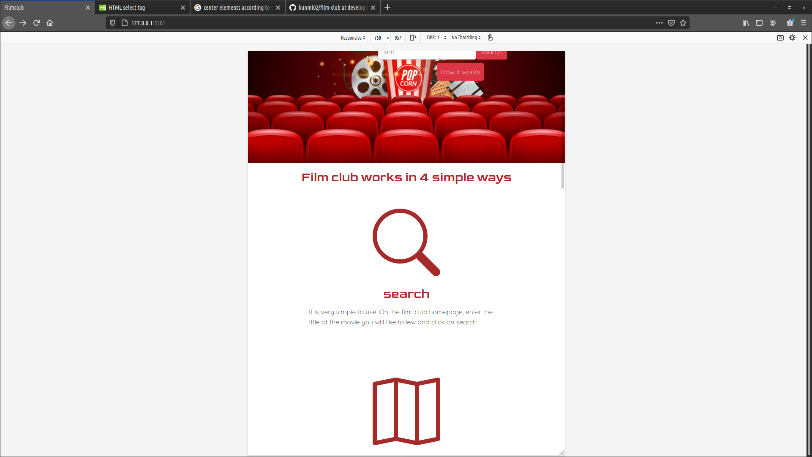
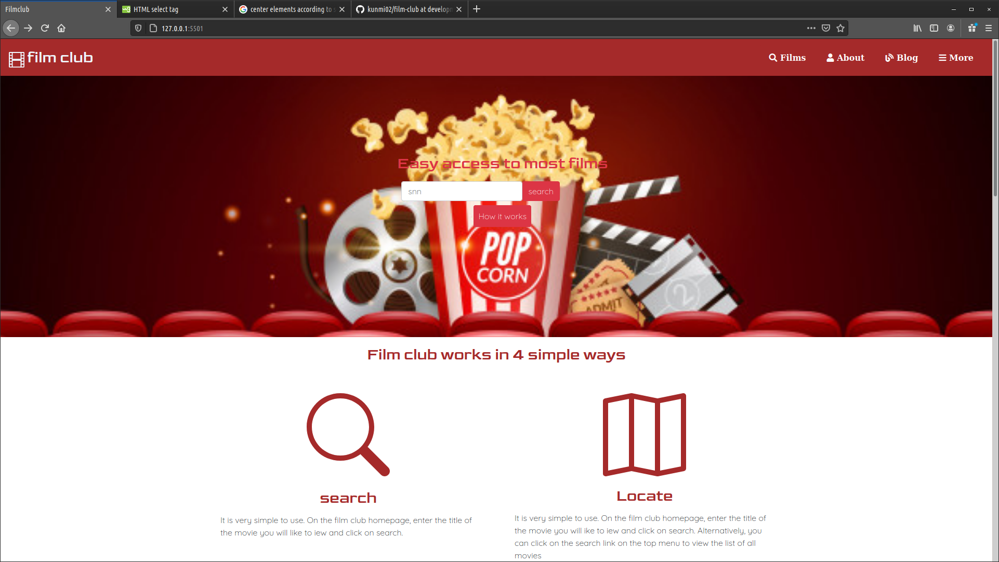

# Film Club (HTML-CSS CAPSTONE PROJECT)

> This project is my capstone project which highligted what I have learnt in the html and css curriculum. The project is a website for movie directory, more like netflix. You can visit the websites, search for movies and watch on the websites.

## Tablet Screen

## Large Screen

Additional description about the project and its features.

## Built With

- HTML & CSS
- SASS
- VsCode
- Font Awesome Icons
- Linters
- Gitflows

## Live Demo

[Live Demo Link](https://kunmi02.github.io/film-club/)

## Authors

👤 **Azeez Ibrahim**

- GitHub: [@githubhandle](https://github.com/kunmi02)
- Twitter: [@twitterhandle](https://twitter.com/akinkunmi006)
- LinkedIn: [LinkedIn](https://linkedin.com/in/akinkunmi006)

## 🤝 Contributing

Contributions, issues, and feature requests are welcome!

- Forking the project
- Cloning the project to your local machine
- `cd` into the project directory
- Run `git checkout -b your-branch-name`
- Make your contributions
- Push your branch up to your forked repository
- Open a Pull Request with a detailed description to the development branch of the original project for a review

Feel free to check the [issues page](https://github.com/kunmi02/film-club/issues/).

## Show your support

Give a ⭐️ if you like this project!

## Acknowledgments

- https://www.behance.net/gallery/25563385/PatashuleKE
-  Mathew Njuguna (For the design)

## 📝 License

This project is does not have an official licence yet.
